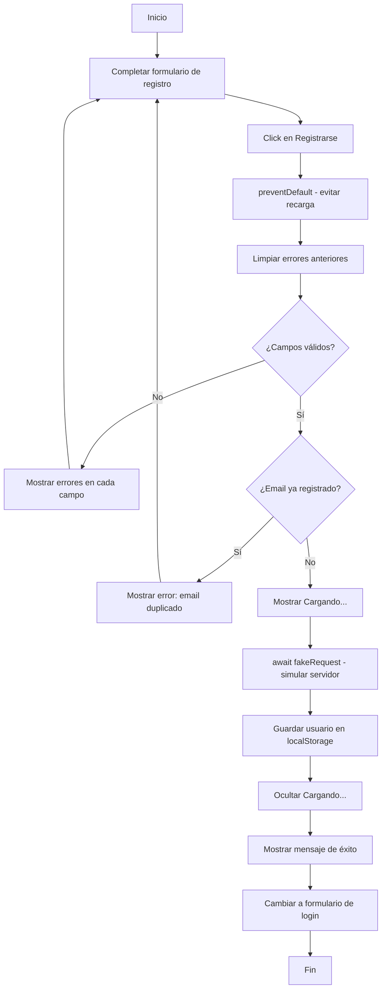
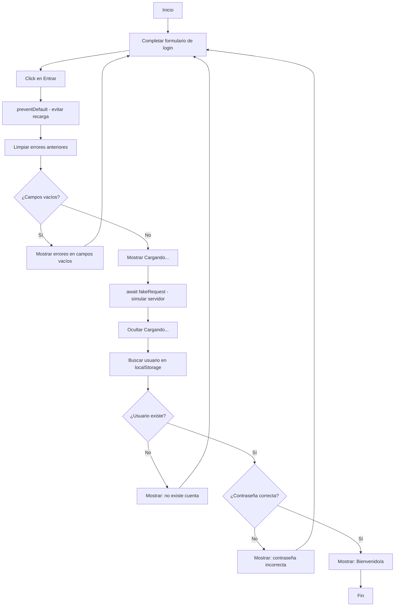

# Módulo de Registro y Login

## Descripción

Módulo de registro y autenticación de usuarios desarrollado con HTML, CSS y JavaScript puro (sin frameworks ni backend). Los datos se almacenan en el navegador usando localStorage. Las peticiones al servidor se simulan con async/await.

## Instrucciones para ejecutar

1. Descargar o clonar el repositorio
2. Abrir el archivo `index.html` en cualquier navegador
3. No requiere instalación adicional ni servidor

## Usuario de prueba

Para probar el login, primero registrar un usuario o usar los siguientes datos después de registrarlos:

- **Email:** prueba@correo.com
- **Contraseña:** clave123

## Estructura del proyecto

```
/parcial-p3
├── index.html    → Página principal con formularios de registro y login
├── styles.css    → Estilos visuales (Flexbox, colores, animaciones)
├── app.js        → Lógica de validación, registro, login y manipulación del DOM
└── README.md     → Este archivo
```

## Esquema del código (app.js)

```
app.js
├── fakeRequest(data)           → Simula petición al servidor (async, 1 segundo)
├── mostrarCargando()           → Muestra mensaje "Cargando..." en pantalla
├── ocultarCargando()           → Oculta el mensaje "Cargando..."
├── limpiarErrores()            → Limpia todos los mensajes de error del DOM
├── mostrarError(campo, msg)    → Muestra un error debajo de un campo específico
├── validarRegistro()           → Valida los campos del formulario de registro
├── obtenerUsuarios()           → Lee los usuarios guardados en localStorage
├── guardarUsuarios(usuarios)   → Guarda los usuarios en localStorage
├── registrarUsuario(e)         → Procesa el registro (async/await)
├── iniciarSesion(e)            → Procesa el login (async/await)
├── mostrarFormulario(tipo)     → Alterna entre vista de registro y login
└── DOMContentLoaded            → Inicializa todos los eventos al cargar la página
```

## Diagrama de flujo

### Proceso de Registro



### Proceso de Login



## Tecnologías utilizadas

- HTML5
- CSS3 (Flexbox)
- JavaScript (ES6, async/await)
- localStorage para persistencia de datos
